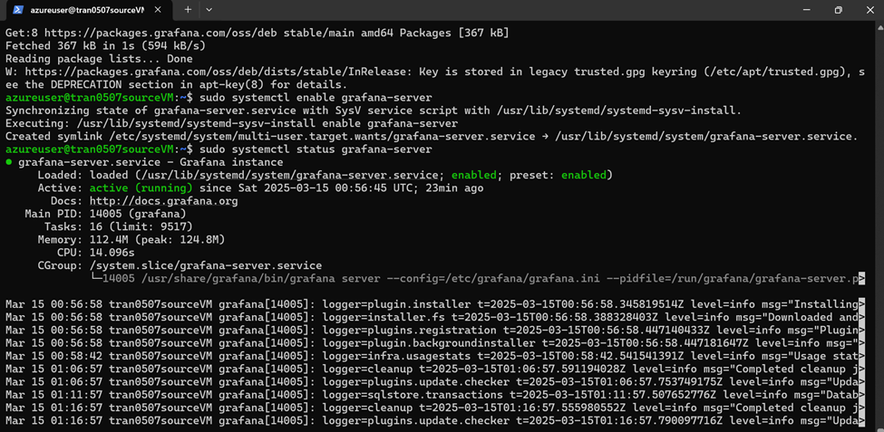
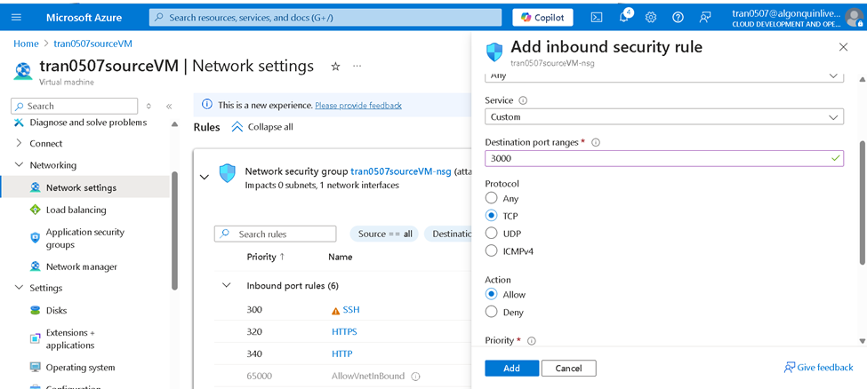
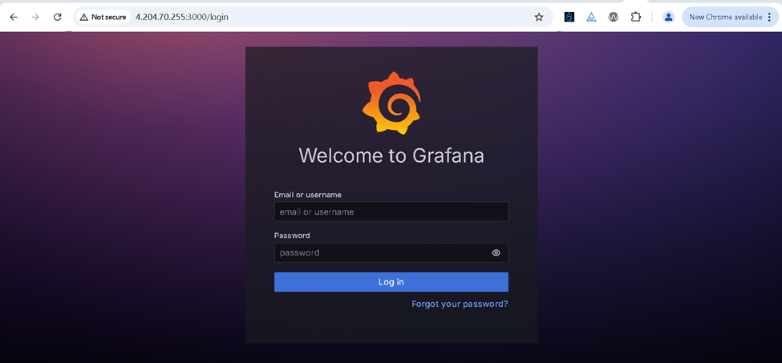
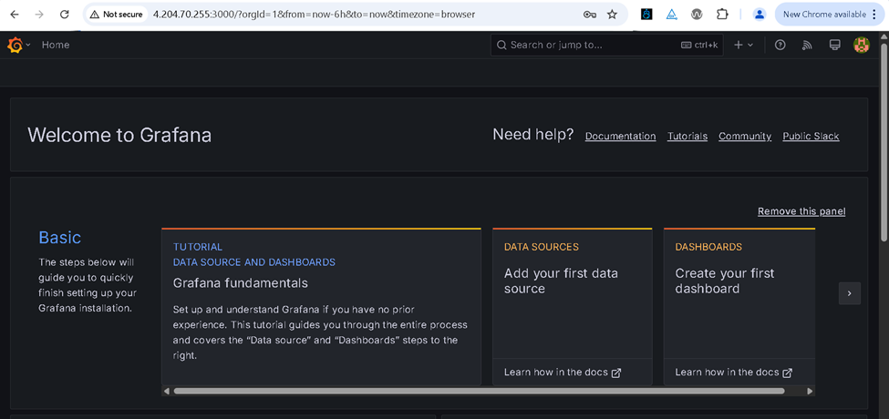
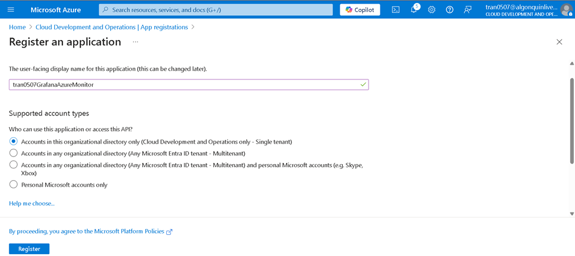
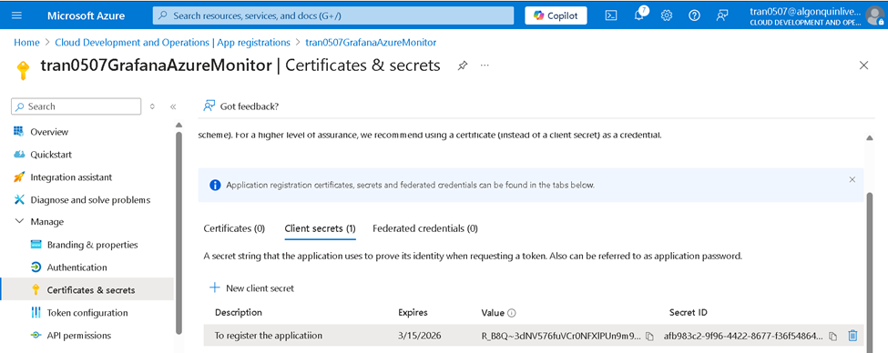
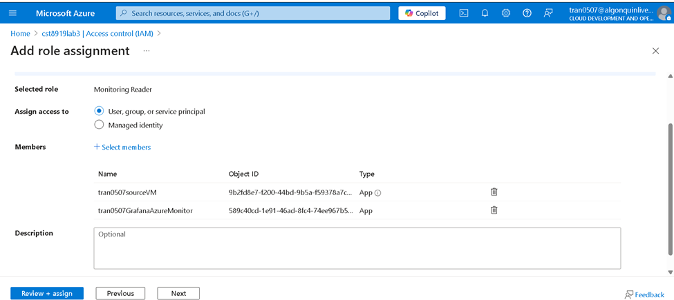
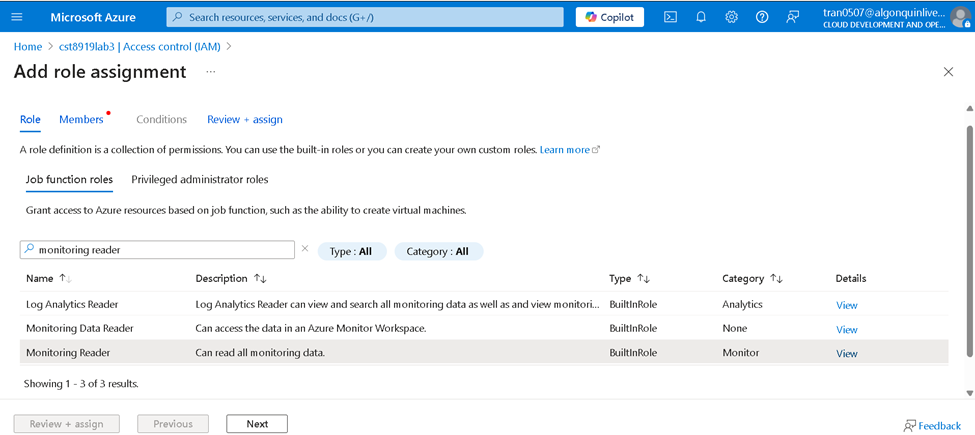
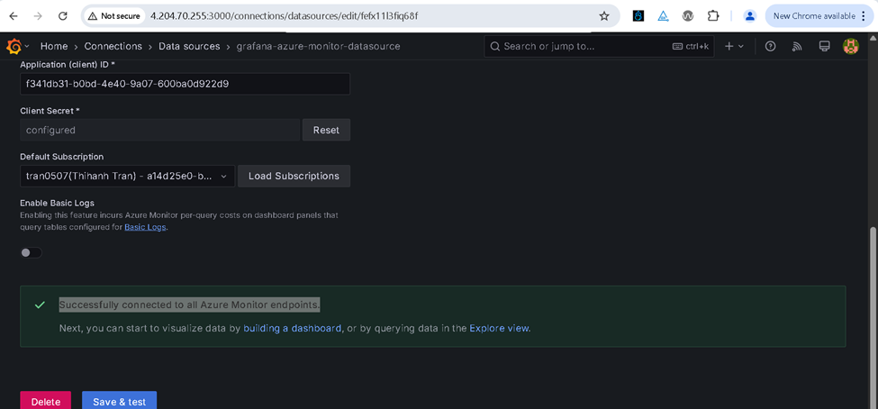
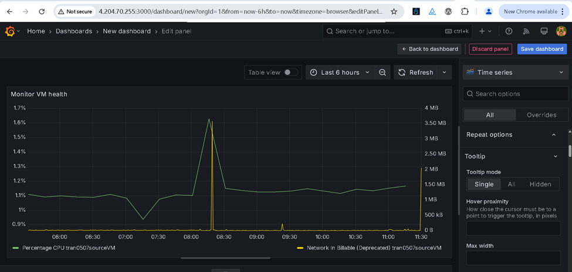

# cst8919Lab3: Grafana Installation and Dashboard Creation for Ubuntu Server Performance

## Result and screenshots: 

### Task 1 & 2
Connected to Grafana server from PowerShell

Add inbound rule to allow conect to rafana server from internet (port 3000)

### Task 5: Connect Grafana to Azure Monitor
- Connect to Grafana server from browser

- Home page of Grafana server

- Register application: in order to allow Grafana connect to Azure VM, we need to register Grafana in Azure Active Directory 

- Add the role ‘Monitoring reader’ for Gafana 

- Create connection from Grafana to Azure VM 

### Task 6: Create a Dashboard in Grafana

